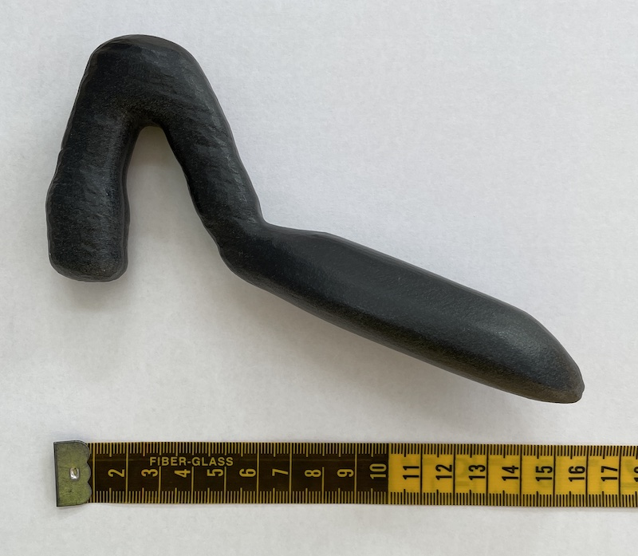

# sextoy
A sex toy that works for people with vaginas.

License: [TAPR Open Hardware](./LICENSE.txt)

Copyright (c) 2023 Maura Hubbell

# Why Design a Sex Toy?

Because no sex toy on the market worked for me, and I've tried a wide variety of sex toys. I know that other trans women, and other middle-aged women, have had the same problem.

I've decided to publish this design as open hardware because I'm doubtful that anyone can build a viable business from a design like this. Even if it's possible, I don't want the hassle of running that business. However, I want as many people to have a copy of this toy as possible as cheaply as possible if they want one.

# How To Use It

The bulbous tip of the inverted V on the left in the image above goes into the vagina. It stimulates the G-spot or, in the case of trans women who've had sex reassignment surgery, the prostate. The flattened area where the inverted V meets the handle stimulates the clitoris. Move the toy as desired.

# Design Files

* **mesh.stl** - STL is a polygon-based CAM format that's popular with manufacturers. This, or something like it, is what you'll need to send to a fabricator. The units for the file are millimeters.
* **mesh.blend** - The [Blender](https://www.blender.org) file from which I generated the STL. The geometry is an extensively edited mesh because Blender's automatic conversion from parametric volumes to polygons leaves numerous artifacts.
* **volume.blend** - The [Blender](https://www.blender.org) file of parametric volumes on which `mesh.blend` is based.

# Fabrication Options

1. **Nylon** - I believe this to be safe because some medical devices are made from nylon. I used the HP Multi Jet Fusion 3D printing process from [Xometry](https://xometry.com). *You need to use the vapor smoothing finish* or your toy will have a surface something like sandpaper.
1. **Polyurethane** - This is the same material that trans women's dilators are made of so I'm confident of its safety, but since it's a molding process, minimum quantities and costs are higher than for nylon.
1. **Glass** - A tried and true safe material for sex toys. It's even dishwasher safe! Unfortunately, custom glass fabrication can have very long lead times as well as high costs.
1. **Stainless steel** - I haven't investigated steel at all, but there are plenty of stainless toys on the market. They are also dishwasher-safe and durable.
1. **Poly(methyl methacrylate)** - I made the earliest versions of this toy out of PMMA (sold under the brand name Lucite&trade;) without the aid of CAD/CAM, only to be informed later that PMMA is *not* body-safe.

Xometry does not claim that any of its processes produce medical-grade devices. I have not investigated what, if anything, differentiates medical-grade plastics from others.
